# Fitness Studio

## Full Stack Frameworks with Django

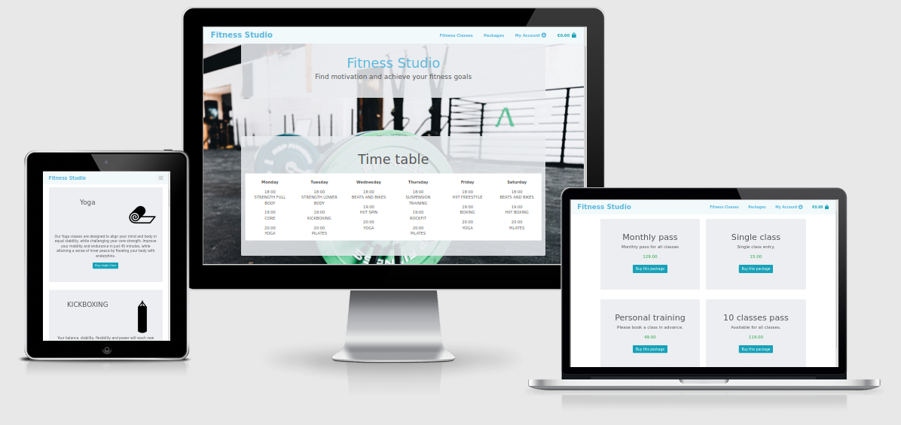

Fitness Studio is a simple website that can help customers to buy a package or packages of choice.
Customers can use contact section to make enquiry or book a class after purchase.

This project is for educational purposes only.

## [View live website](https://fitnesssstudio.herokuapp.com/)
___
# Table of contents

- [UX](#ux)
    - [Strategy](#strategy)
    - [Scope](#scope)
        - [User stories](#user-stories)
    - [Structure of the website](#structure-of-the-website)
    - [Skeleton](#skeleton)
    - [Surface](#surface)
- [Features](#features)
- [Technologies used](#technologies-used)
- [Testing](#testing)
- [Deployment](#deployment)
- [Credits](#credits)

___
# UX

## Strategy

The purpose of this project is to build a simple website that customers to buy a package or packages of choice.
This website can be easily changed for different type of businesses.
This template can be used as charity website, car mechanic, florist, or any other business without multiple choices and options.

## Scope

A MVP (minimum viable product) includes:

- landing page with and timetable and three simple cards
- fitness classes page with class description
- packages with a secure online shop functionality
- register and login pages
- contact page

### User stories

**ID** | **As a/an** | **I want to be able to...** | **So that I can**
--- | --- | --- | ---
1 | Site User | Register to the site | Log in to my account 
2 | Site User | Log In and Log Out | View my profile
3 | Site User | Receive email confirmation | Confirm successful registration
4 | Site User | Have a user profile | View my purchases, and be able to check my order history
5 | Potential customer | View a list of packages | Select to purchase
6 | Potential customer | View packages details | See price and description
7 | Potential customer | Contact fitness studio | Book a place
8 | Customer | View items in my bag | Check the cost to review
9 | Customer | Enter payment information and see that process is secure | Checkout without issues
10 | Customer | Contact fitness studio after payment | Booked a place
11 | Administrator | Add new classes or packages | To make them visible to customer
12 | Administrator | Edit or update classes or packages | To change a price, description or time
13 | Administrator | Delete classes or packages | To remove from a site

## Structure of the website

Website contains:
- fixed navigation bar or burger icon on mobile devices with essential links to navigate on the website
- main content site which changes on every action taken by a user.
- secure online shop functionality

## Skeleton

### Wireframes

- Home Page

    

Desktop (click to view)

    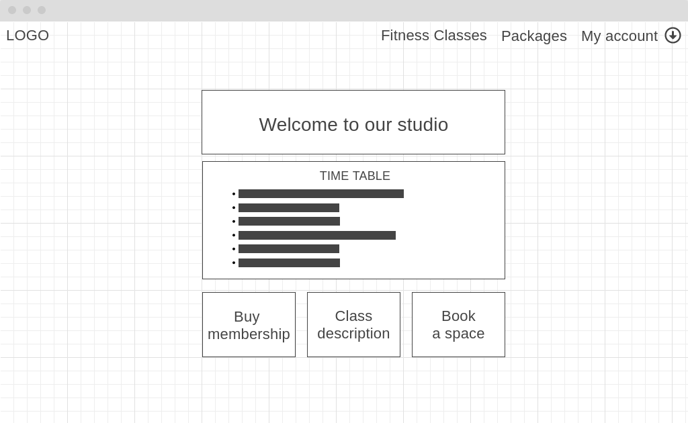
    

    

Mobile (click to view)

    
    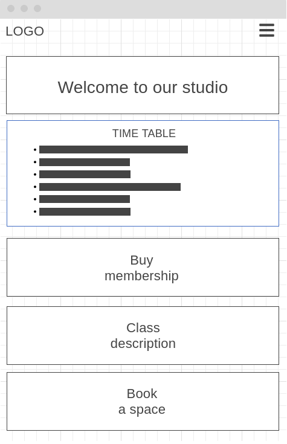
    

- Fitness classes page

    

Desktop (click to view)

    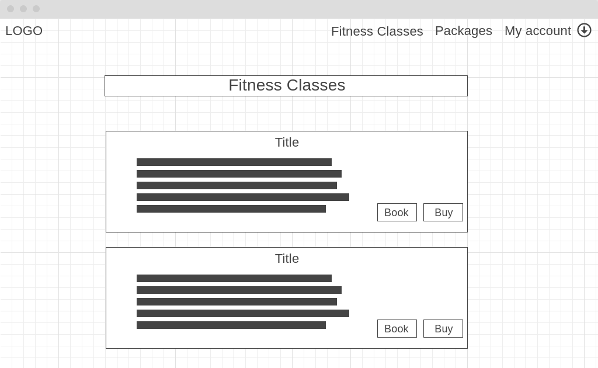
    

    

Mobile (click to view)

    
    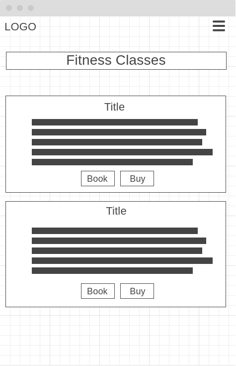
    

- Packages page

    

Desktop (click to view)

    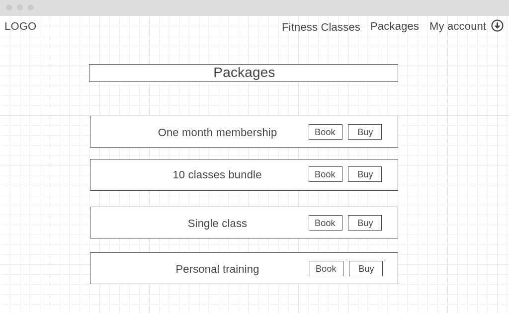
    

    

Mobile (click to view)

    
    
    

- Packages details

    

Desktop (click to view)

    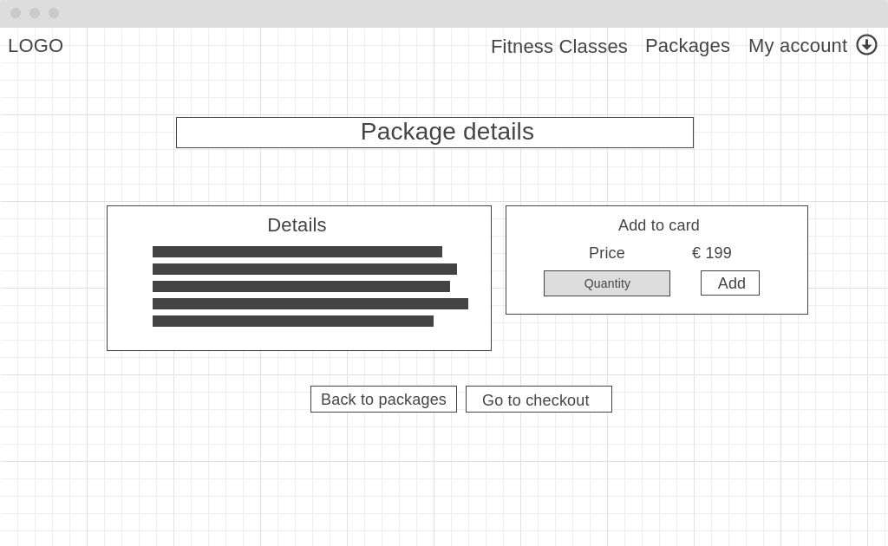
    

    

Mobile (click to view)

    
    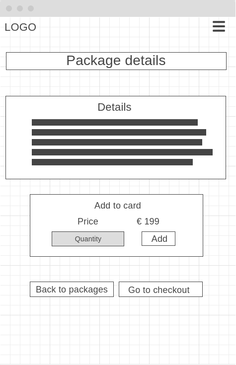
    

- Checkout

    

Desktop (click to view)

    
    

    

Mobile (click to view)

    
    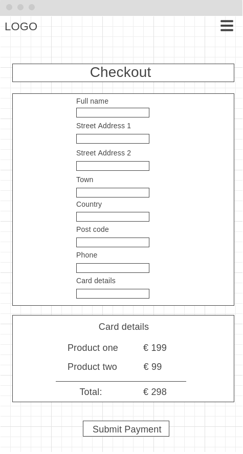
    

- Login

    

Desktop (click to view)

    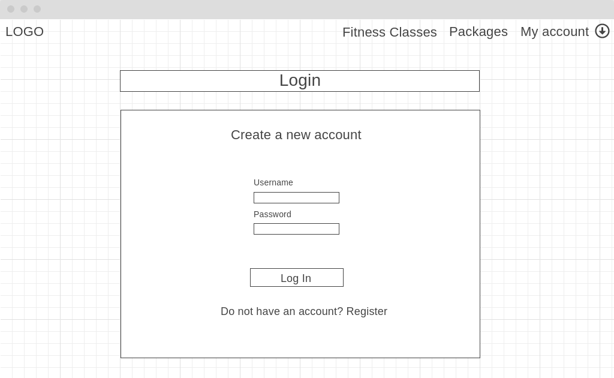
    

    

Mobile (click to view)

    
    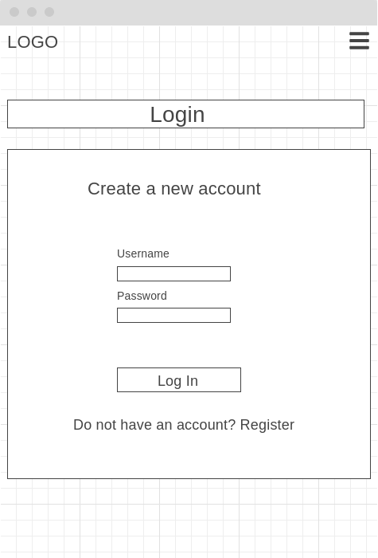
    

- Register

    

Desktop (click to view)

    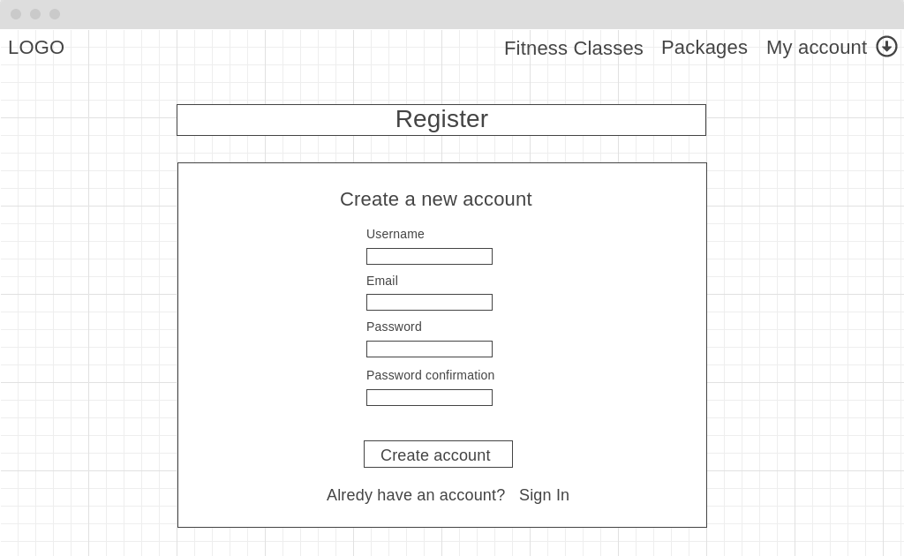
    

    

Mobile (click to view)

    
    
    

### Divergence final website look from wireframes

I had to change an idea of functionality website during a project. Here are differences:
- On home page there is an `contact us` link instead of book a space. 
- On fitness classes and packages pages there is no `book` button.
- On package details I change buttons to: `Go to Bag`, `Add to Bag` and `Go back and add more`
- On Register and Login pages I used crispy forms instead of custom form that I had in mind.

### Database schema

Database contains 6 tables (collections):
- user
- order
- user's packages
- package
- categories
- class

I use Django default databases SQLite in gitpod environment and PostgreSQL database with Heroku as production enviroment.

Database schema (click to view)

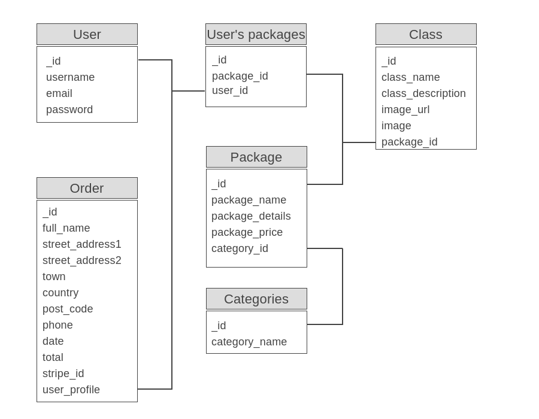

#### User table for checkout app:

| Database Key | Field Type | 
:-------------:|:----------------:
order_number | CharField
user_profile | ForeignKey
full_name | CharField
street_address1 | CharField
street_address2 | CharField
town | CharField
country | CountryField
postcode | CharField
phone_number | CharField
email | EmailField
date | DateTimeField
total | DecimalField
original_bag | TextField
stripe_pid | CharField

#### User table for classes app:

| Database Key | Field Type | 
:-------------:|:----------------:
id | IntegerField
name | CharField
description | TextField
image_url | URLField
image | ImageField

#### User table for packages app:

- #### Category:

| Database Key | Field Type | 
:-------------:|:----------------:
id | IntegerField
name | CharField

- #### Packages:

| Database Key | Field Type | 
:-------------:|:----------------:
category | ForeignKey
id | IntegerField
name | CharField
description | TextField
price | DecimalField

#### User table for profiles app:

| Database Key | Field Type | 
:-------------:|:----------------:
user | OneToOneField
phone_number | CharField
street_address1 | CharField
street_address2 | CharField
town | CharField
postcode | CharField
country | CountryField

### Security

All sensitive access keys are stored as `Config Vars` on Heroku cloud application platform.
Django allauth was used to meet security requirements.

## Surface

### Colors

### Fonts

### Images

[Back to Table of contents](#table-of-contents)
___
# Features

## Navigation bar

## Sites

### Possible future implementations:

[Back to Table of contents](#table-of-contents)
___
# Technologies used

[Back to Table of contents](#table-of-contents)
___
# Testing

[Back to Table of contents](#table-of-contents)
___
# Deployment

[Back to Table of contents](#table-of-contents)
___
# Credits

### Code:

### Images:

### Content

[Back to Table of contents](#table-of-contents)
___
